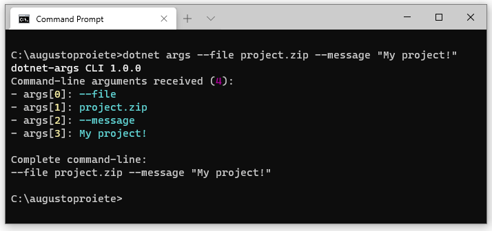

| README.md |
|:---|

<div align="center">


</div>

<h1 align="center">dotnet-args</h1>
<div align="center">

 Cross-platform .NET CLI Tool that prints the command-line arguments it receives, to help debug scripts and apps.

[](https://www.nuget.org/packages/dotnet-args/) [](https://dotnet.microsoft.com/download) [](https://dotnet.microsoft.com/download) [](http://stackoverflow.com/questions/tagged/dotnet-tool)



</div>

## Give a Star! :star:

If you like or are using this project please give it a star. Thanks!

## Background

When developing applications that can receive command-line arguments, it can be useful to test what command-line arguments the application would receive without actually running the application.

Another example where `dotnet-args` can be useful is when writing scripts for multiple platforms (e.g. `run.cmd`, `run.ps1`, `run.sh`, etc.) that _forward_ arguments to an application or another script. You can modify the scripts temporarily to forward the arguments to `dotnet-args` instead of the real application, and test that the scripts are forwading the arguments as expected.

## Prerequisites

The latest version of **dotnet-args** runs on Windows, OSX, and Linux using one of the following versions of .NET:
- .NET 7.0
- .NET 6.0
- .NET 5.0
- .NET Core 3.1
- .NET Core 2.1

## Getting started :rocket:

Install the `dotnet-args` .NET CLI Tool from NuGet:

```powershell
dotnet tool install dotnet-args --global
```

Next, call `dotnet-args` with the arguments that you'd like to test, for example:

```powershell
dotnet args --file project.zip --message "My project!"
```


> More details on .NET CLI tools available on the official [documentation](https://docs.microsoft.com/en-us/dotnet/core/tools/global-tools) from Microsoft.

## Release History

Click on the [Releases](https://github.com/augustoproiete/dotnet-args/releases) tab on GitHub.

---

_Copyright &copy; 2020-2022 C. Augusto Proiete & Contributors - Provided under the [Apache License, Version 2.0](LICENSE). `dotnet-args` logo is a derivative of work by [Goescat Wei](https://www.iconfinder.com/goescat) ([original](https://www.iconfinder.com/icons/3246759/cli_command_root_software_terminal_icon))._
